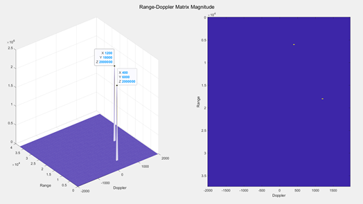
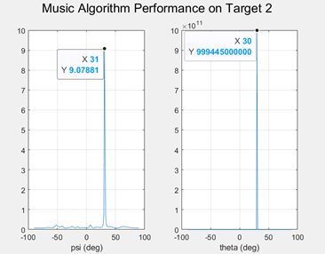
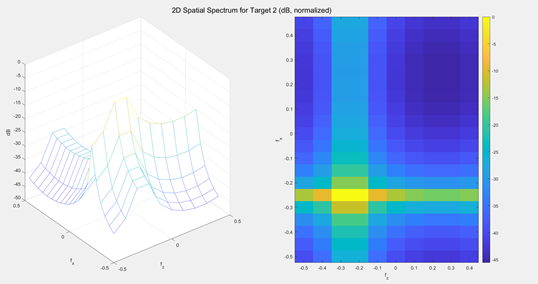

# Pulse Radar Simulation (Range–Doppler + DOA on a 2D UPA)

MATLAB implementation for **Homework 10 (Array Processing)**: A **pulsed radar** observes echoes from **two moving targets** using a **2D uniform planar array (UPA)**, then estimates:

- **Range**
- **Doppler**
- **Direction of Arrival (DOA)** angles (via three methods)

## Repository Contents

- **`AP_HW10_810103297.m`**  
  Main script: defines radar/array settings, simulates targets, runs Range–Doppler processing, detects targets, and estimates angles with 3 approaches.

- **`Range_Doppler_Process.m`**  
  Computes the **Range–Doppler map** for one antenna element (fast-time matched filtering + slow-time Doppler processing).

- **`MP.m`**  
  A lightweight **Matching Pursuit (MP)** solver used here in **1-sparse** mode (selects the single best steering “atom”).

## How to Run

1. Open MATLAB in this folder
2. Run:
   - `AP_HW10_810103297.m`

The script will generate the Range–Doppler map, detect peaks, and print/plot the estimated parameters.

## Configuration

### Radar waveform parameters

| Parameter | Value |
|---|---:|
| Carrier frequency (`fc`) | 150 MHz |
| Sampling rate (`fs`) | 1 MHz |
| Pulse width (`τ`) | 1 µs |
| PRI(`Tp`) | 250 µs |
| Recording time (`Trec`) | 25 ms |

### Receiver array (UPA on x–z plane)

| Parameter | Value |
|---|---:|
| Elements in x (`Mx`) | 20 |
| Elements in z (`Mz`) | 10 |
| Total elements (`M`) | 200 |
| Element spacing (`Δd`) | λ/2 |

### Targets (noise-free in the main run)

| Target | Range | Doppler | Elevation θ | Azimuth φ | Amplitude |
|---:|---:|---:|---:|---:|---:|
| 1 | 6 km | 400 Hz | 45° | 37° | 1 |
| 2 | 18 km | 1200 Hz | 30° | 53° | 1 |

---

## What the Main Script Does

### 1) Generate the transmit pulse train
Creates a rectangular baseband pulse repeated every PRI for the full recording time.  
This reference signal is later used for matched filtering.

### 2) Build a steering-vector dictionary
Creates a grid of candidate steering vectors over:
- `θ ∈ [-90°, 90°]` (1° step)
- `ψ ∈ [-90°, 90°]` (1° step)

This dictionary is reused by the DOA estimators.

### 3) Simulate received data across the array
For each target, the received signal at each antenna element includes:
- a time delay (range)
- a Doppler tone (velocity)
- a phase shift across the array (angle)

The two target returns are summed to produce the final measurement.

### 4) Compute Range–Doppler maps and detect targets
For each antenna element, `Range_Doppler_Process` produces a Range–Doppler coefficient matrix.  
The script then **combines energy across antennas** to form a strong detection map and finds peaks via a simple threshold.

*Figure 1 — Combined Range–Doppler magnitude (summed across antennas).*

### 5) Estimate angles for each detected (Range, Doppler) cell
For every detected target cell, the script extracts a “snapshot” across antennas and runs **three DOA estimators**:

#### A) Matching Pursuit (MP), 1-sparse
Selects the single steering vector in the dictionary that best matches the snapshot.

#### B) SVD + MUSIC (separable 1D MUSIC on x and z)
Reshapes the snapshot into an `Mx × Mz` array snapshot, uses SVD to separate signal/noise subspaces, and applies MUSIC along each axis.

*Figure 2 — Example MUSIC spectra showing peaks at the estimated angles.*

#### C) 2D FFT peak (beamspace / uniform-array property)
Computes a 2D FFT of the array snapshot and chooses the strongest spatial-frequency peak.

*Figure 3 — Example 2D spatial spectrum. The peak location is mapped back to angles.*

> **Note on angles:** The code searches in `(θ, ψ)` and then converts to `φ`. Small mismatches vs ground-truth are expected due to **1° grid resolution** and the conversion step.

## Results

### Ground truth

| Target | Range (m) | Doppler (Hz) | θ (deg) | φ (deg) |
|---:|---:|---:|---:|---:|
| 1 | 6000 | 400 | 45 | 37 |
| 2 | 18000 | 1200 | 30 | 53 |

### 1) Matching Pursuit (MP)

| Target | Range (m) | Doppler (Hz) | θ (deg) | ψ (deg) | φ (deg) |
|---:|---:|---:|---:|---:|---:|
| 1 | 6000 | 400 | 45 | 34 | 37.738 |
| 2 | 18000 | 1200 | 30 | 31 | 53.508 |

### 2) SVD + MUSIC

| Target | Range (m) | Doppler (Hz) | θ (deg) | ψ (deg) | φ (deg) |
|---:|---:|---:|---:|---:|---:|
| 1 | 6000 | 400 | 45 | 34 | 37.738 |
| 2 | 18000 | 1200 | 30 | 31 | 53.508 |

### 3) 2D FFT peak

| Target | Range (m) | Doppler (Hz) | θ (deg) | ψ (deg) | φ (deg) |
|---:|---:|---:|---:|---:|---:|
| 1 | 6000 | 400 | 53.130 | 36.870 | complex |
| 2 | 18000 | 1200 | 23.578 | 30.000 | 56.938 |

⚠️ With `Mz=10`, the **vertical resolution is limited**, and θ can be noticeably off.  
That can also make the φ conversion invalid for a target (shown as `complex` in the report).

#### Extra experiment (larger array in the report)
When increasing resolution to `Mx=Mz=50`, the 2D FFT approach improves:

| Target | θ (deg) | ψ (deg) | φ (deg) |
|---:|---:|---:|---:|
| 1 | 46.055 | 34.056 | 36.201 |
| 2 | 28.685 | 31.332 | 53.648 |

## Practical notes

- **Detection threshold:** The script uses a fixed threshold suitable for the **noise-free** run.  
  For noisy data, consider a higher threshold.
- **Grid resolution:** Angle accuracy for MP/MUSIC is limited by the `(θ, ψ)` grid step (currently **1°**).
- **2D FFT method:** Works best with enough samples/aperture, especially along **z** (larger `Mz`).

